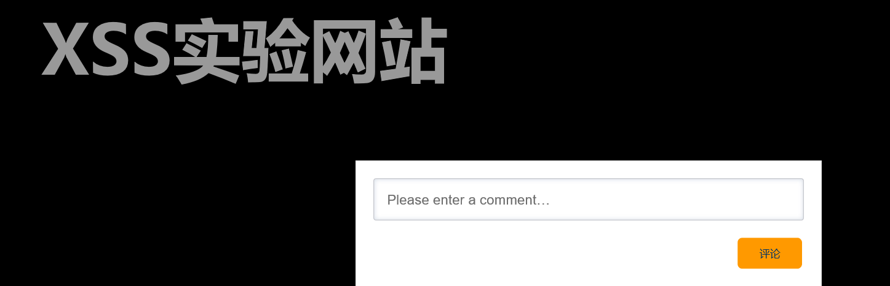
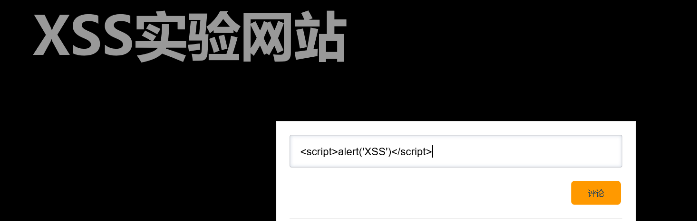
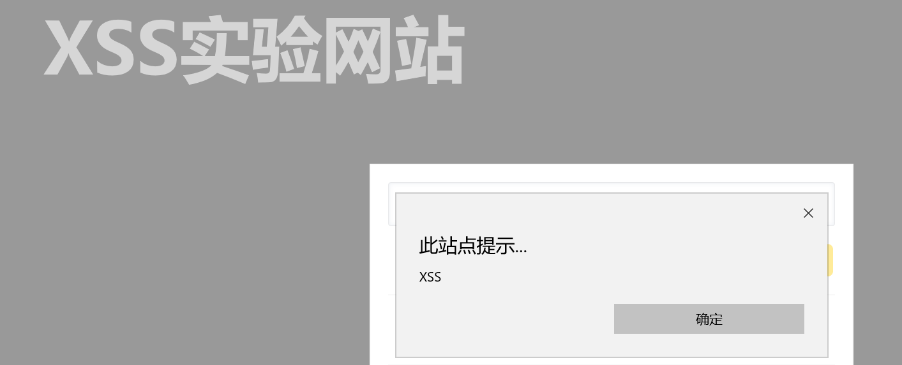

# 实验一 XSS实验

## **一、实验目的**
* 搭建简易网站作为实验环境，通过测试脚本，实现XSS漏洞测试。

## **二、基础知识**
* 跨站脚本攻击XSS(Cross Site Scripting)。恶意攻击者向Web页面里插入恶意Script代码，当用户浏览该页面时，嵌入Web里面的Script代码会被执行，从而达到恶意攻击用户的目的。
* 反射型XSS：非持久化，需要欺骗用户自己去点击链接才能触发XSS代码（服务器中没有这样的页面和内容），一般容易出现在搜索页面。反射型XSS大多数是用来盗取用户的Cookie信息。

## **三、实验环境**
* 安装Apache和php 
  * 安装过程参考视频[指南](https://www.bilibili.com/video/BV1oE411V7xz?from=search&seid=13933215547277478486)

## **四、实验内容**
* 搭建测试网站
* （这里使用的是之前搭建的网站，“评论”键功能为“提交”）

* 表单中填写“”，提交到后端。

* 前端弹窗，攻击成功。

