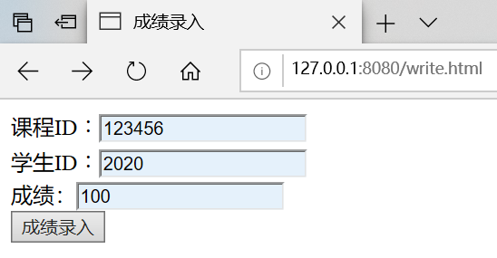
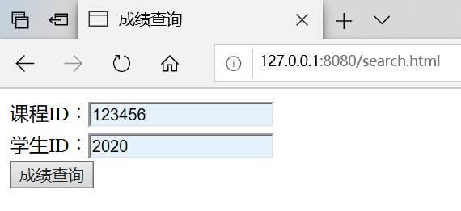

# 实验二 sqlite库编程

## **一、实验目的**
* 使用pyhton的sqlite库来编程操作数据库。
  * 在实验一httpserver.py的基础上，继续编写漏洞。
  * 分别编写两个页面：
    * 成绩录入页面，要求内容包括课程ID,学生ID,成绩；
    * 成绩查询页面，实现输入课程ID，学生ID,查询得到成绩。

## **二、实验过程**
* 建立数据库
```bash
sqlite3.exe edu.db
sqlite> .table
sqlite> create table stuinfo(course_id INTEGER,student_id INTEGER,grades INTEGER);
sqlite> .table
```
  

* 编写成绩录入和成绩查询的代码
```bash
        elif 'grades' in fields:   #录入成绩
            course_id, student_id, grades = form_data['course_id'].value,\
                                            form_data['student_id'].value, \
                                            form_data['grades'].value
            conn = sqlite3.connect('edu.db')
            c = conn.cursor()
            sql = "insert into stuinfo values (%s, %s, %s)"%(course_id, student_id, grades)
            c.execute(sql)
            conn.commit()
            conn.close()
            flag=1

        else:                       #查询成绩
            course_id, student_id = form_data['course_id'].value, form_data['student_id'].value
            conn = sqlite3.connect('edu.db')
            c = conn.cursor()
            sql = "select grades from stuinfo where course_id=%s and student_id=%s"%(course_id, student_id)
            c.execute(sql)
            grades = "%s 同学 %s 课程的成绩为:  " % (student_id, course_id) + str(c.fetchone()[0])
            conn.close()
            flag=2
```
* 编写对应页面的html代码
  * 成绩录入页面
  
  * 成绩查询页面
  
## **三、实验结果**
* 运行
  * 成绩录入



  * 成绩查询



* 实验完成
