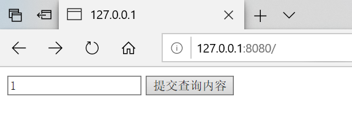
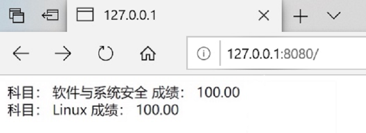
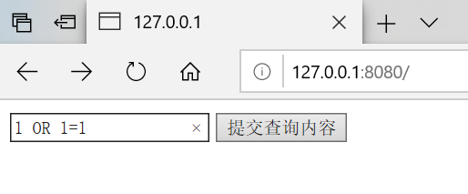
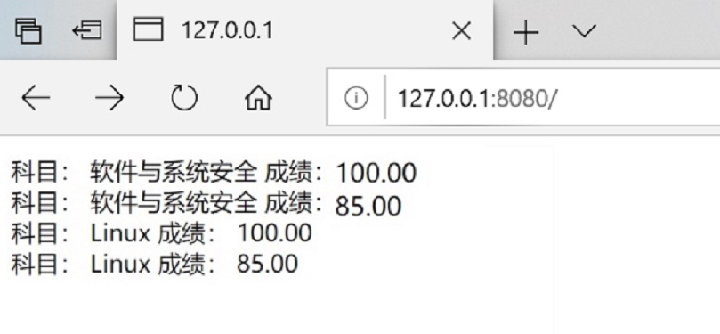

# 实验三 sql注入

[范老师仓库](https://code.aliyun.com:fwqcuc/soft-sec.git)  

## sql_injection.py文件
* sql_injection.py这个文件是一个独立的httpserver，它的运行就是独立运行py文件。
* 在vscode中调试，需要增加launch.json的配置。(也可直接命令行运行)
* 输入学生ID为1，查询对应的成绩。
   
   
* sql_inject漏洞就出现在代码43行，直接把用户输入的数据，作为sql语句中的查询条件。
*  若查询条件变成了 student_id = 1 OR 1=1，1=1恒为真， 任何数OR真值，也是真。变成了无条件查询。   


```sql
SELECT edu_admin_course.name, edu_admin_score.score FROM edu_admin_score INNER JOIN edu_admin_course ON edu_admin_score.course_id=edu_admin_course.id WHERE student_id = 1 OR 1=1
```


     
     

* 避免这个漏洞的方法
* 1.对用户输入进行过滤，比如这里。我们可以判断一下 input_data是否数字就可以。用python内置函数 isdigit，就可以判断，但是对于大型的系统，会有很多sql语句拼接和执行的地方。每一个都去过滤，编程效率很低，而且不一定能保证你写的过滤就是对的。
* 2.Django,ORM。ORM完全避免了程序员直接接触sql语言，所有的sql语句都在模型管理器中有框架进行拼接。程序员在编程时，只需要使用模型管理器提供的方法进行查询，创建等，就可以了。 

* 这些方法返回的数据类型是QuerySet数据类型。这个数据类型是一个数据库访问的接口。在调用filter时，实际上还未查询数据库，只是初步完成了数据库sql语句的拼接。实际的查询是在render中进行的。Django会根据render时需要的具体数据，来精确优化查询语句，所有这里的result，并不是真正的查询结果。而是一个查询对象。

## 内存管理

* 以4MB（页）作为基本管理单元的虚拟内存管理。
* 虚拟内存管理是一套虚拟地址和物理地址对应的机制。
* 程序访问的内存都是虚拟内存地址，由CPU自动根据系统内核区中的地址对应关系表（分页表）来进行虚拟内存和物理内存地址的对应。
* 每个进程都有一个分页表。
* 每个进程都有一个完整的虚拟内存地址空间，x86情况下为4GB（0x00000000-0xffffffff）
* 但不是每个地址都可以使用（虚拟内存地址没有对应的物理内存）
* 使用VirtualAlloc API可以分配虚拟内存（以页为单位）、使用VirtualFree释放内存分页。
* 使用VirtualProtect 修改内存也保护属性（可读可写可执行）
* 数据执行保护（DEP）的基本原理
* malloc和free等C函数（也包括HeapAlloc和HeapFree等）管理的是堆内存，堆内存区只是全部内存区的一个部分。
* 堆内存管理是建立在虚拟内存管理的机制上的二次分配。
* 真正的地址有效还是无效是以分页为单位的。
* 内存分页可以直接映射到磁盘文件（FileMapping）、系统内核有内存分页是映射物理内存还是映射磁盘文件的内存交换机制。
* 完成内存分页管理的相关实验

### 观察两个实验证明

* 1.int main() 
{
 char* a = malloc(100);
 a[101] = 'a';}
  * 分配了100个字节的内存单位。写入的时候写到时候，超出了两个字节。这段代码，在执行的时候。不会有异常情况.程序能够正常退出。
  * 原因在于，操作系统对内存的管理，也是有开销的。系统本身需要在一块单独的系统内存中记录那些内存是可用的，那些内存是不可用的。如果记录内存是否可用这个信息太细，那么记录所有的内存开销就很高。所以，实际上，没有记录到这么细.在Windows系统中，通常是以4KB为单位进行管理的。也就是要么这4KB都可用，要么都不可用。这样，所需要的管理数据就小得多。所以虽然我们只分配了100个字节，但是这100个字节所在的整个4KB的内存全
  * 所以呢，malloc还不是最底层的内存管理方式。malloc我们称为堆内存管理。malloc可以分配任意大小的数据，但是，malloc并不管理一块数据是否有效的问题。而是由更底层的虚拟内存管理来进行的.一个4KB的内存管理单元，我们称为一个内存分页。当malloc在内存分配时，如果已经可用的分页中，还有剩余的空间足够用，那么malloc就在这个可用的分页中拿出需要的内存空间，返回地址。如果已经可用的分页不够用，再去分配新的分页。然后返回可用的地址。所以，malloc分配可以比较灵活，但是系统内部，不会把内存搞得特别细碎,都是分块的。

* 2.在任务管理器中，切换到详细信息页面。会发现每个进程的内存占用全部都是4KB的倍数。

* 观察以上两点，证明了系统确实以4KB作为单元在管理内存，要么4KB全部有效，要么全部无效。

* 实验完成！