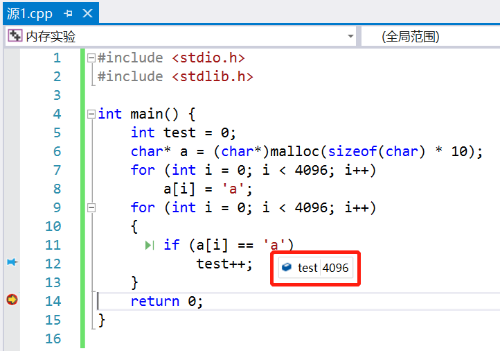
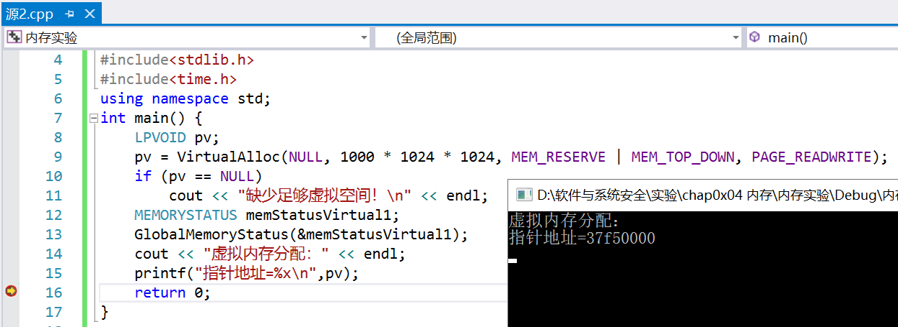
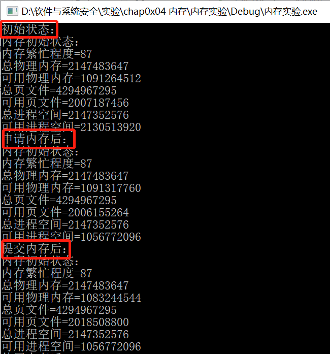

# 实验四 内存

## **一、实验目的**
* 阅读VirtualAlloc、VirtualFree、VirtualProtect等函数的官方文档。
* 编程使用malloc分配一段内存，测试是否这段内存所在的整个4KB都可以写入读取。
* 使用VirtualAlloc分配一段，可读可写的内存，写入内存，然后将这段内存改为只读，再读数据和写数据，看是否会有异常情况。然后VirtualFree这段内存，再测试对这段内存的读写释放正常。

## **二、实验内容**
#### （一） 编程使用malloc分配一段内存，测试是否这段内存所在的整个4KB都可以写入读取
* c语言中char型占1字节，4KB就是4096个字节；   
* 运行程序，可以观察到test=4096，即4KB空间都可以进行读取； 
*  

#### （二）使用VirtualAlloc分配一段，可读可写的内存，写入内存，然后将这段内存改为只读，再读数据和写数据，看是否会有异常情况。然后VirtualFree这段内存，再测试对这段内存的读写释放正常
* 使用VirtualAlloc分配一段可读可写的内存； 
* 分配成功！
      

* 整个申请-提交-写入-释放内存的过程
    *  代码
 ```c
    #include "windows.h"
    #include "conio.h"
    #include <iostream>
    using namespace std;
    void MemoryStatus()
    {
    	MEMORYSTATUS memStatus;
    	GlobalMemoryStatus(&memStatus);
    	cout << "内存初始状态：" << endl;
    	cout << "内存繁忙程度=" << memStatus.dwMemoryLoad << endl;
    	cout << "总物理内存=" << memStatus.dwTotalPhys << endl;
    	cout << "可用物理内存=" << memStatus.dwAvailPhys << endl;
    	cout << "总页文件=" << memStatus.dwTotalPageFile << endl;
    	cout << "可用页文件=" << memStatus.dwAvailPageFile << endl;
    	cout << "总进程空间=" << memStatus.dwTotalVirtual << endl;
    	cout << "可用进程空间=" << memStatus.dwAvailVirtual << endl;
    }

    int main()
    {
    	cout << "初始状态：" << endl;
    	MemoryStatus();
    	//申请内存
    	char* lpv = (char*)VirtualAlloc(NULL, 1024 * 1024 * 1024, MEM_RESERVE,PAGE_READWRITE);
    	cout << "申请内存后：" << endl;
    	MemoryStatus();
    	//提交内存
    	lpv = (char*)VirtualAlloc(lpv, 1024 * 1024 * 1024, MEM_COMMIT,PAGE_READWRITE);
    	cout << "提交内存后：" << endl;
    	MemoryStatus();
    	//使用内存
    	strcpy(lpv, "abc");
    	cout << "使用内存后：" << endl;
    	MemoryStatus();
    	//释放内存
    	VirtualFree(lpv, 1024 * 1024 * 1024, MEM_RELEASE);
    	system("pause");
    	return 0;
    }
```
   * 实验结果：
  由 VirtualAlloc 分配的内存（可读可写）内存可以正常的写入和读取   
       
        
 
* 使用 VirtualProtect 修改一段内存的访问属性
  * 函数：VirtualProtect (PVOID 基地址，SIZE_T 大小，DWORD 新属性，DWORD 旧属性)
    ```c
    vp = VirtualProtect(
      lpv,
      PAGELIMIT * dwPageSize,	 // 需要改变访问属性的区域大小
      PAGE_READONLY,           // 只读
      &oldProtect	             // 在修改前，旧的访问属性将被存储
    );
    ```   
  * 实验结果：
   引发异常，写入访问权限冲突     

  * 更改一页的页面属性，改为只读后无法访问，还原后可以访问
    ```c
    DWORD protect;
    iP[0]=8;
    VirtualProtect(lpv,4096,PAGE_READONLY,&protect);
    int * iP=(int*)pV;
    iP[1024]=9;                //可以访问，因为在那一页之外
                               //iP[0]=9;不可以访问，只读
    //还原保护属性
    VirtualProtect(lpv,4096,PAGE_READWRITE,&protect);
    cout<<"初始值="<<iP[0]<<endl;    //可以访问
    ```
  * 实验结果：将访问属性修改为 PAGE_READONLY 后，该段内存无法写入，但可以正常读取

   * 释放内存代码
   
    ```c
    //只释放物理内存
    VirtualFree((int*)pV+2000,50*1024*1024,MEM_DECOMMIT);
    int* a=(int*)pV;
    a[10]=2;//可以使用，没有释放这一页
    MEMORYSTATUS memStatusVirtual3;
    GlobalMemoryStatus(&memStatusVirtual3);
    cout<<"物理内存释放："<<endl;
    cout<<"增加物理内存="<<memStatusVirtual3.dwAvailPhys-memStatusVirtual2.dwAvailPhys<<endl;
    cout<<"增加可用页文件="<<memStatusVirtual3.dwAvailPageFile-memStatusVirtual2.dwAvailPageFile<<endl;
    cout<<"增加可用进程空间="<<memStatusVirtual3.dwAvailVirtual-memStatusVirtual2.dwAvailVirtual<<endl<<endl;
    ```
    * 实验结果：内存释放后将无法读取和写入