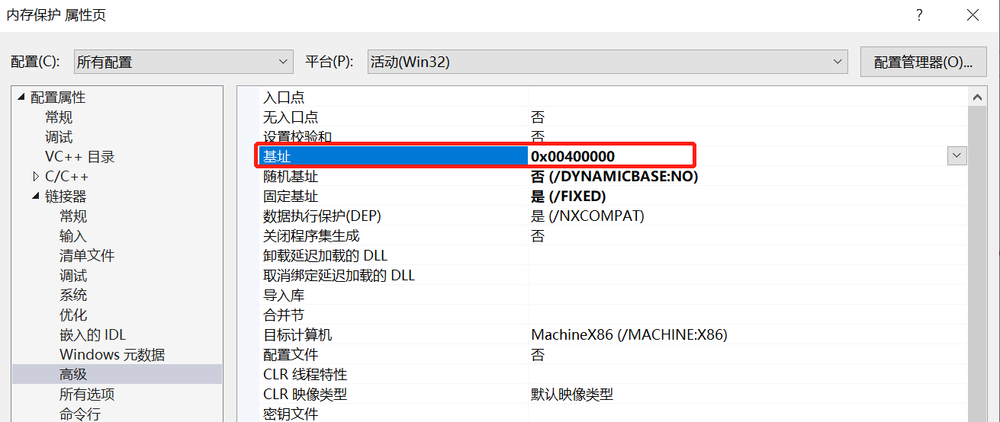
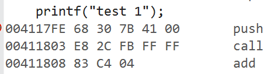
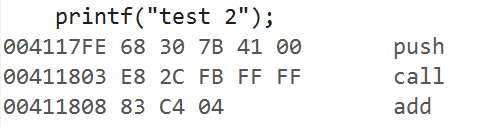
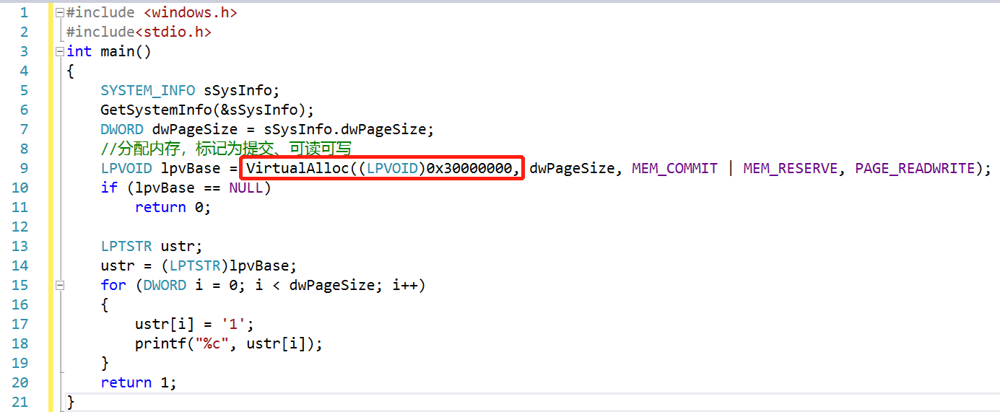
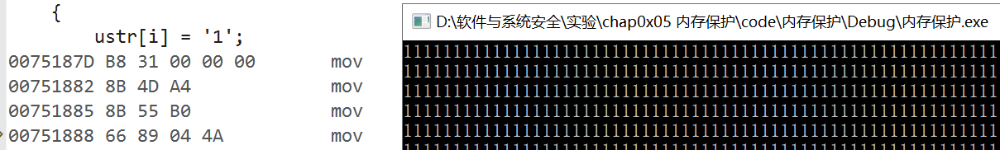
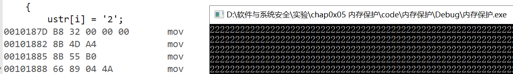

# 实验五 内存保护

## **一、实验目的**
* 验证不同进程的相同的地址可以保存不同的数据。
  * 在VS中，设置固定基地址，编写两个不同可执行文件。同时运行这两个文件。然后使用调试器附加到两个程序的进程，查看内存，看两个程序是否使用了相同的内存地址；
  * 在不同的进程中，尝试使用VirtualAlloc分配一块相同地址的内存，写入不同的数据。再读出。

## **二、基础知识**
* 要了解底层的操作系统级别的内存管理的原因：
  * 因为在溢出型漏洞攻击中，内存地址的有效性在漏洞利用程序的编写中是首要考虑的问题。漏洞攻击的目的，要驻留在系统内，而不是引起系统的崩溃。
  * 如果对内存访问不对，读写到了不可用的内存地址上。那么引起的效果是崩溃程序退出，那么攻击程序也就退出结束运行了。
  * 所以，攻击程序必须要考虑内存地址的有效性的。
* 我们的应用程序，我们所有编写的exe文件，所有使用的地址，都不是物理地址。而是一套虚拟地址系统。
* 分页表
  * 在OS的内核中，有一个非常重要的数据结构，称为分页表。这个分页表其实就是记录了每个分页地址是否可用的。
  * 它其实还记录了一个非常重要的内容，就是这一块分页，对应的是哪一个物理内存。他们以4KB单位对应。
  * 在真正的数据访问的过程中，每次访问，系统都会去查分页表，把访问的虚拟地址，在分页表中表项的记录中找到这一块虚拟地址分页对应的物理地址分页。分页内部的偏移不会变。
  * 而且，每一个进程都有一个分页表。所以其实可以把不同的进城的相同分页，对应到不同的物理地址上。
  * 在32位系统中。地址空间从0x0-0xFFFFFFFF。一共4GB。也是一个进程最多可以有4GB的内存可用。
  * 但是我们的物理内存并没有那么多。往往一个进程也使用不了4GB这么大的数据。所以，系统是，只用进程需要使用了，才把内存分页的地址对应到物理地址上。有的时候，各个进程所使用的总内存会超过物理内存的总大小。这种情况下，部分分页会被缓存到硬盘上。但是缓存到硬盘上的内存分页数据在使用的时候，又需要载入到物理内存。专业术语叫分页交换 swap。所以，有的时候，跑大型的程序，内存占用很多，超过了物理内存大小，这时候程序仍然能运行，但是变得很慢。就因为系统在不停的进行分页交换，而硬盘的访问比内存的速度差了1-2个数量级。
  * 进程的相同地址的分页可以映射到不同的物理地址上，同样也能映射到相同的物理内存上。比如动态链接库，每个进程都会调用基础的动态链接库，只需要把分页表中项对应过来就好了。让虚拟内存分页对应到已经存在的物理内存分页中。

## **三、实验内容**
* 代码：
   ```c
  //test1
  #include<stdio.h>
  int main()
  {
  	printf("test 1");
  }

  //test2
  #include<stdio.h>
  int main()
  {
  	printf("test 2");
  }
  ```
#### 设置相同固定基址
* 在VS中，编写两个不同的可执行文件，基地址都设置为0x00400000。

* 同时运行两个文件可以观察到：两个程序的地址完全相同，但是可以正常执行。可见不同进程的相同的地址是可以保存不同的数据的。  
     
      

#### 使用VirtualAlloc函数分配一块相同地址的内存 
* 在不同的进程中，尝试使用VirtualAlloc分配一块相同地址的内存，写入不同的数据。
* 新建两个工程，同时执行，可以发现写入的内存地址完全相同，但写入的内容不同：
    * 代码如下：
      
  * 执行两个程序的结果如下
    * 第一个工程的结果：  
             
    * 第二个工程的结果：  
            

* 可以发现确实在相同的内存存入了不同的数据，具有内存保护