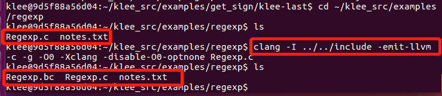
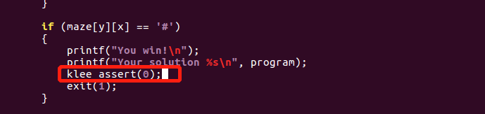

# 实验八 Klee
## **一、实验目的**
* 安装KLEE，完成[官方tutorials](https://klee.github.io/tutorials/testing-function/)
* 至少完成前三个

## **二、实验环境**
* VM虚拟机 ubuntu server

## **三、实验内容**
### 3.1实验准备  
* 安装docker 
  ```bash
    #更新apt包索引：
    $ sudo apt-get update
    #安装以下包以使apt可以通过HTTPS使用存储库（repository）：
    $ sudo apt-get install -y apt-transport-https ca-certificates curl software-properties-common
    #添加Docker官方的GPG密钥：
    $ curl -fsSL https://download.docker.com/linux/ubuntu/gpg | sudo apt-key add -
    #使用下面的命令来设置stable存储库：
    $ sudo add-apt-repository "deb [arch=amd64] https://download.docker.com/linux/ubuntu $(lsb_release -cs) stable"
    #再更新一下apt包索引：
    $ sudo apt-get update
    #安装最新版本的Docker CE：（需要一定时间）
    $ sudo apt-get install -y docker-ce
    ```
* 查看docker服务是否启动：$ systemctl status docker
  * 可见已经成功启动    
      
* 在docker中安装klee
    ```bash
    # 安装 KLEE
    sudo docker pull klee/klee:2.0
    ```
     
* 安装完成
    
* 创建KLEE Docker容器的几种方法
    ```bash
    # 创建一个临时容器 一次性的
    docker run --rm -ti --ulimit='stack=-1:-1' klee/klee:2.0
    # 创建一个长期容器，名为klee_dxy
    sudo docker run -ti --name=klee_dxy --ulimit='stack=-1:-1' klee/klee
    # 退出后可通过名字再次进入
    sudo docker start -ai klee_dxy
    # 删除长期容器
    docker rm klee_dxy
    ```

### 3.2实验过程
#### 【1】 Tutorial 1: Testing a small function.
  * 运行 tutorial
  ```bash
   # 创建一个临时容器(为了测试实验用)
    docker run --rm -ti --ulimit='stack=-1:-1' klee/klee:2.0
  ```
    
  * 示例代码`get_sign.c`在 `/klee_src/examples/get_sign` 目录下，用来判断一个整数的正，负，或者为0.
    ```c
    #include <klee/klee.h>
    int get_sign(int x) {
      if (x == 0)
         return 0;
      if (x < 0)
         return -1;
      else 
         return 1;
    } 
    int main() {
      int a;
      klee_make_symbolic(&a, sizeof(a), "a");
      return get_sign(a);
    }
    ```    
        
  * klee_make_sybolic是KLEE自带的函数，用来产生符号化的输入。因为KLEE是在LLVM字节码上进行工作，所以我们首先需要将.c编译为LLVM字节码.执行命令:
    ```bash
    clang -I ../../include -emit-llvm -c -g -O0 -Xclang -disable-O0-optnone get_sign.c
    ```
  * 上一步执行完成后，再同目录下会生成一个get-sign.bc的字节码文件     
       
  * KLEE跑起来 `klee get_sign.bc`
    * 结果中KLEE给出了总指令数，完整路径和生成的测试案例数。
       
  + 当前目录下多生成了两个文件：klee-last 和 klee-out-0
    * 其中klee-out-0是本次测试结果
    * klee-last是最新测试结果   
         
  * 函数有3条路径，a等于0，a小于0，a大于0。每一条路径都生成了一个测试例。
  * 对于探索的每条道路，KLEE执行的输出是一个目录（在本例中为klee-out-0），其中包含KLEE生成的测试用例
       
  * KLEE生成的测试用例被写入扩展名为.ktest的文件中。这些是二进制文件，可以使用ktest-tool实用程序读取
    * 可见每一个测试文件包括调用的参数、符号对象、路径的数量(1)、象征性的对象的名字(a)、它的大小(4)  
    * 第一个测试为0，第二个测试为16843009，最后一个测试为-2147483648。
    * KLEE生成了值0，一个正值（16843009）和一个负值（-2147483648）  
     
     

#### 【2】tutorial 2: Testing a simple regular expression library.
* 示例代码`Regexp.c`位于`/home/klee/klee_src/examples/regexp`目录下
* 同理，先将Regexp.c这个 C 语言文件编译转化为 LLVM bitcode
  ```bash
  clang -I ../../include -emit-llvm -c -g -O0 -Xclang -disable-O0-optnone Regexp.c
  ```
      
* 使用 KLEE 运行代码：
  ```bash
  klee --only-output-states-covering-new Regexp.bc
  ```
     
  * 可以发现，代码的23、25行出现了报错
  * KLEE 在程序执行时发现了错误，会生成能触发错误的测试用例，并将关于错误的附加信息写入文件`testN.TYPE.err`（`N`是测试样例编号，`TYPE`指明错误类型）
      
  * 查看错误信息文件  
        
     
  * 出现内存错误。输入的正则表达式序列完全是符号的，但是match函数期望它是一个以null结尾的字符串。
  * 解决方法：将' \0 '符号化后存储在缓冲区的末尾。需要使用编辑器（vi/vim）修改代码。
  * 安装 vim
    * 向/etc/apt/sources.list中逐条写入以下内容
    * 以指令`sudo sh -c "echo 'deb-src http://mirrors.163.com/ubuntu/ bionic-backports main restricted universe multiverse' >> ./sources.list"`的方式
    ```bash
    deb http://mirrors.163.com/ubuntu/ bionic main restricted universe multiverse
    deb http://mirrors.163.com/ubuntu/ bionic-security main restricted universe multiverse
    deb http://mirrors.163.com/ubuntu/ bionic-updates main restricted universe multiverse
    deb http://mirrors.163.com/ubuntu/ bionic-proposed main restricted universe multiverse
    deb http://mirrors.163.com/ubuntu/ bionic-backports main restricted universe multiverse
    deb-src http://mirrors.163.com/ubuntu/ bionic main restricted universe multiverse
    deb-src http://mirrors.163.com/ubuntu/ bionic-security main restricted universe multiverse
    deb-src http://mirrors.163.com/ubuntu/ bionic-updates main restricted universe multiverse
    deb-src http://mirrors.163.com/ubuntu/ bionic-proposed main restricted universe multiverse
    deb-src http://mirrors.163.com/ubuntu/ bionic-backports main restricted universe multiverse
    ```
     
    修改完成后需：  
    ```bash
    sudo apt-get apdate
    sudo apt-get install vim
    ```
  * 安装成功后修改代码：
    ```bash
     int main() {
       // The input regular expression.
       char re[SIZE];
       // Make the input symbolic.
       klee_make_symbolic(re, sizeof re, "re");
       re[SIZE - 1] = '\0';
      // Try to match against a constant string "hello".
       match(re, "hello");
       return 0;
     }
    ```   
       

  * 重新将Regexp.c这个 C 语言文件编译转化为 LLVM bitcode，运行新的Regexp.bc文件       
        
  * 成功执行！

#### 【3】tutorial 3:Solving a maze with KLEE
* 一个11*7的迷宫问题，程序中故意在迷宫的第二行开了一个后门。该示例显示了如何使用KLEE查找迷宫游戏的所有解决方案。
* 下载迷宫程序
  ```bash
  # Update aptitude 
  sudo apt-get update
  # Install git 
  sudo apt-get install -y git-core
  # Download maze 
  git clone https://github.com/grese/klee-maze.git ~/maze
  # Build & Run Maze
  # Source is in maze.c.
  cd ~/maze
  #Build: 
  gcc maze.c -o maze
  #Run manually: 
  ./maze
  # 此时命令行会等待输入，输入如下
  # 表示移动命令 w (up), d (right), s (down), a (left)ssssddddwwaawwddddssssddwwww
  ```       
  * 执行 ./maze 后  
        
    最终结果：  
        
* 修改源代码，把用户手动输入改为符号测试
  * 将read调用改成klee_make_symbolic  
        
  * 增加一个`klee_assert(0);`---每次成功就会又一次assert  
        
* 对修改后的源文件进行编译测试，得到所有成功以及失败的例子
  ```bash
  cd ~/maze
  #Build LLVM Bytecode: 
  ./scripts/build_bc.sh #(builds "maze_klee.bc" using "clang -emit-llvm")
  #Ignore the "implicit declaration of function '__assert_fail'" warning.
  #Run Klee on Bytecode: 
  ./scripts/run_klee.sh #(runs klee on "maze_klee.bc" using "--emit-all-errors")
  #Show solutions: 
  ./scripts/show_solutions.sh #(gets klee test results from "ktest-tool", and prints maze solutions)
  klee@a72909e66efc:~/maze$ ./scripts/show_solutions.sh
  
  TESTID       SOLUTION
  test000135:  sddwddddsddw................
  test000211:  ssssddddwwaawwddddsddw......
  test000251:  sddwddddssssddwwww..........
  test000301:  ssssddddwwaawwddddssssddwwww
  ```
  * 执行./scripts/run_klee.sh的结果： （所有用例） 
       
  * 在`show_solutions.sh`中查看成功的例子   
       
  * 手动输入也可验证这四种方式确实能够win

* 此迷宫示例确实显示了如何使用KLEE查找迷宫游戏的解决方案
* 实验成功！